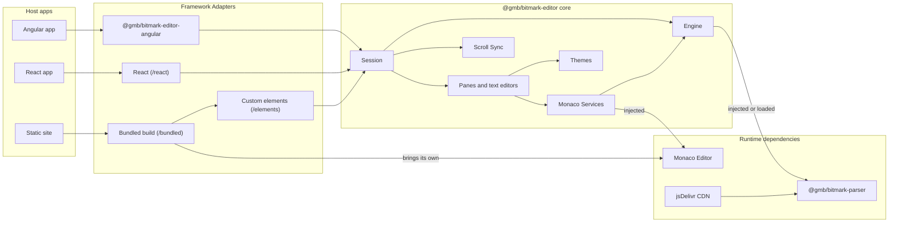
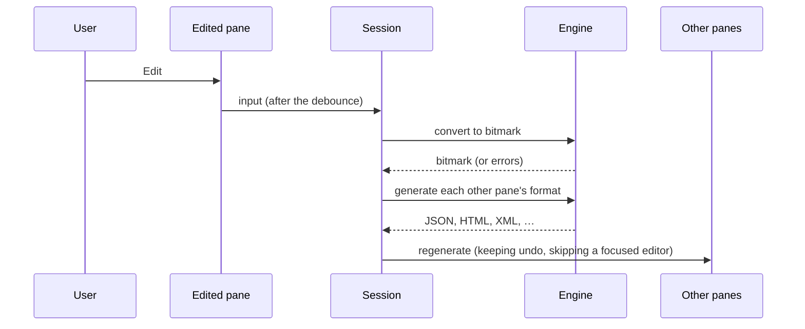
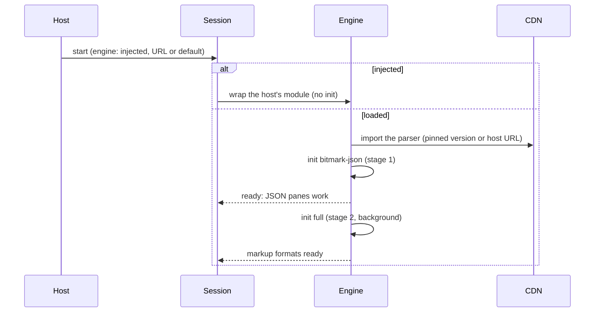

# Architecture

## Project Purpose

bitmark editor gives other web apps the bitmark and JSON editors of the
bitmark Playground. It is a framework-agnostic package, `@gmb/bitmark-editor`,
plus an Angular wrapper, `@gmb/bitmark-editor-angular`. Both are built on
Monaco, with the bitmark parser doing the language work. A host gets one
bitmark document per session and places its panes (bitmark, JSON, HTML, XML,
Text, Info, Mappings) anywhere; editing any pane updates the others. Hosts
include the cosmic web app (Angular), the bitmark docs site (static) and the
Playground (React).

## System Overview

- Engine — the bitmark parser behind an async interface: on the main thread or in a worker, injected by the host or loaded by the package
- Monaco Services — bitmark highlighting, diagnostics, completion and hover, and the JSON schema, on a host's Monaco
- Session and Panes — one document per session, with independent panes that convert through it
- Scroll Sync — linked scrolling of any set of panes, by bit
- Themes — dark, light, auto and custom themes over CSS variables
- Framework Adapters — custom elements, a React adapter, and the Angular wrapper package
- Bundled Build — the elements with their own Monaco, ready for a CDN
- Build, Test and Release — npm workspace, esbuild, Angular CLI, GitHub Actions

## Technology Stack

- `TypeScript 5` — the source of both packages
- `Monaco Editor 0` — the editors (peer `>=0.46 <1`; `/bundled` ships 0.57)
- `@gmb/bitmark-parser 7` — the Rust/WASM bitmark parser (peer, loaded at runtime or injected)
- `React 18` — the optional React adapter (peer `>=18`)
- `Angular 21` — the Angular wrapper (peer `>=21 <23`), built with ng-packagr
- `esbuild 0` — the core's `/esm` and `/bundled` builds
- `Vitest 4` — unit tests (jsdom)
- `Playwright 1` — browser checks of the examples, the docs site and the Angular example
- `Eleventy 3` and `Pagefind 1` — the docs site and its search
- `typedoc 0` — the API reference
- `npm 11` — workspaces, scripts and publishing (trusted publishing)
- `Node 24` — development and CI
- `GitHub Actions` — CI, Pages, releases

## High-Level Architecture



## Directory Structure

```text
packages/bitmark-editor/                  # @gmb/bitmark-editor (npm workspace)
packages/bitmark-editor/src/engine/       # BitmarkEngine, the parser loader, the worker engine
packages/bitmark-editor/src/monaco/       # Monaco setup and the per-editor services
packages/bitmark-editor/src/session/      # Sessions, conversion, messages
packages/bitmark-editor/src/panes/        # Pane types and their styles
packages/bitmark-editor/src/editor/       # One Monaco editor on its own model
packages/bitmark-editor/src/scroll/       # Scroll groups and bit positions
packages/bitmark-editor/src/theme/        # Themes and token styles
packages/bitmark-editor/src/elements/     # Custom elements (/elements)
packages/bitmark-editor/src/react/        # React adapter (/react)
packages/bitmark-editor/src/bundled/      # The CDN build with Monaco inside (/bundled)
packages/bitmark-editor/scripts/          # The build and the parser bump (`npm run bump:parser`)
packages/bitmark-editor/examples/         # Static-site and /esm examples, browser checks (npm workspace)
packages/bitmark-editor/docs/             # Hand-offs to host apps; typedoc output (docs/api, not committed)
packages/bitmark-editor-angular/          # Angular CLI project: the wrapper library and a cosmic-shaped example (standalone npm project)
examples/                                 # Example apps (vanilla-ts, react, angular), each its own npm project on packed tarballs, and their smoke tests
docs-site/                                # The docs site: guides, live demos, the API reference (Eleventy, Pagefind; npm workspace; built and tested, not yet deployed)
scripts/                                  # Repo scripts: the release helper, the example apps' pack/install/build/test
.github/workflows/                        # CI, Pages, Release
.awa/                                     # Architecture and plans
```

## Component Details

### Engine

The bitmark parser behind one async interface, `BitmarkEngine`, whoever loaded it.

RESPONSIBILITIES

- Load the parser at a pinned default version from jsDelivr, or from a host URL, in two stages: `bitmark-json` first, then `full` in the background
- Accept a parser module that the host already loaded and initialised, without initialising it again
- Run on the main thread or in workers (`/worker`), with the same interface
- Convert bitmark to JSON and other formats, and back, and provide the language results (semantic tokens, diagnostics, completion, hover)

CONSTRAINTS

- The default parser version is one exact version, bumped by hand (`npm run bump:parser`) within the peer range's major
- A load failure shows in the panes and reaches the host as an `error` event; a failed stage 2 leaves stage 1 working

### Monaco Services

The bitmark language support on a Monaco instance that the host provides.

RESPONSIBILITIES

- Register the `bitmark` language and its token styles once per Monaco instance (`setupBitmarkMonaco`), and attach highlighting, diagnostics, completion and hover per editor (`attachBitmarkEditor`)
- Highlight bitmark from the parser's semantic tokens, applied as decorations
- Complete a bit type to the bit's template, as a snippet
- Bind the bitmark JSON schema in Monaco's JSON service for the package's own models
- Drop results that a newer edit has made stale

CONSTRAINTS

- Highlighting is available once the parser has loaded; attached editors re-highlight then
- Services act only on the package's own models, never on a host's other editors

### Session and Panes

One bitmark document, the source of truth, shown in any number of panes.

RESPONSIBILITIES

- Hold the document and convert each edit, with an optional debounce, last edit winning
- Provide panes for bitmark, JSON, HTML, XML, Text, Info and Mappings; any pane can be read-only
- Regenerate the other panes from each edit, without echoing a pane's own edit back to it
- Keep each pane's undo history across regeneration, and never overwrite a focused editor
- Report errors and status in the host's language (`messages`)

CONSTRAINTS

- The host places panes anywhere; a session imposes no layout

### Scroll Sync

Linked scrolling of any set of panes and host editors, by bit.

RESPONSIBILITIES

- Keep the same bit in view in every member of a scroll group, whichever member is scrolled
- Map positions through the parser's bit spans, including in typed text
- Let a host join its own editors to a session's group

### Themes

Dark, light, auto and custom looks, over CSS variables.

RESPONSIBILITIES

- Style panes and bitmark tokens through CSS variables that a host can map onto its own design tokens
- Set Monaco's page-global theme only when the host asks for it

### Framework Adapters

The core in the shape each kind of host expects.

RESPONSIBILITIES

- Custom elements (`/elements`): `<bitmark-session>`, `<bitmark-pane>`, `<bitmark-tabs>`, `<bitmark-split>`, `<bitmark-editor>`, with lazy start (`idle`, `click`, `focus`, `visible`) and a static fallback on narrow touch screens
- React (`/react`): `<BitmarkSession>`, `<BitmarkPane>`, `useBitmarkSession`
- Angular (`@gmb/bitmark-editor-angular`): `bm-session` (a form control), `bm-pane`, `bm-tabs`, `bm-split`, `provideBitmarkEditor`

CONSTRAINTS

- The Angular wrapper runs Monaco outside the Angular zone and re-enters it only to emit
- Importing `/elements` during server-side rendering does nothing

### Bundled Build

The custom elements with their own Monaco, for pages without one.

RESPONSIBILITIES

- Load Monaco, its CSS and its workers only when the first session starts
- Find its files beside `bundled.js`, or where `setBitmarkAssetBase` points
- Leave a page's existing Monaco alone, with a warning

### Build, Test and Release

The repository's tooling, from a clean install to a published version.

RESPONSIBILITIES

- npm workspace for the core and its examples; the Angular project installs and builds separately against the core's `dist`
- Build the core with esbuild (`/esm`, `/bundled`) and tsc (declarations); build the Angular library with ng-packagr
- CI on every PR: lint, typecheck, unit tests, builds, package checks (publint, attw, `npm pack`), API docs, browser checks of the examples, the docs site and the Angular example
- Build the example apps (plain TypeScript, React, Angular) from tarballs of the current build, as an outside app would install them, and smoke-test each one
- Deploy only the API reference (typedoc) to GitHub Pages from `main`, at the site's root, until the guides are ready. Until then the READMEs keep every link into the docs site inside an HTML comment (`<!-- docs-site-links … -->`), hidden on GitHub, npm and the API reference
- Build the docs site (guides, live demos on `/bundled`, the API reference) and smoke-test every internal link, the demos, search and the theme toggle in CI, so it stays ready to deploy. While `guidesPublic` (`docs-site/src/_data/site.js`) is false, its root redirects to the API reference, the overview is at `/overview/`, and every guide page is marked `noindex`
- Publish both packages from a `v<version>` tag by npm trusted publishing, then create the GitHub Release
- Open weekly dependency PRs (Dependabot); the default parser version is bumped by hand

CONSTRAINTS

- `main` changes only through PRs, with the `core` and `angular` checks green; repository admins may merge a PR before its checks finish (ruleset bypass, pull requests only)
- Only repository admins create release tags; only those tags can deploy to the `npm` environment

## Component Interactions

A host creates a session (directly, or through an element or component)
with its Monaco, or the bundled one, and an engine source. The session starts
the engine and mounts its panes. Each pane's editor gets the Monaco services,
which ask the engine for language results. An edit in any pane goes to the
session, which converts it through the engine to bitmark and regenerates the
other panes. Panes that link scrolling join the session's scroll group, which
maps positions between them by bit.

### Edit Flow



### Parser Loading Flow



## Architectural Rules

- The parser MUST be loaded at runtime (from the CDN or a host URL) or injected by the host; it is never bundled into the package
- The package MUST NOT call `init` on a parser module a host injected
- Bitmark highlighting MUST come from the parser's semantic tokens, never from a separate grammar
- Bitmark editors MUST apply tokens as decorations, not through Monaco's semantic tokens feature, whose request delay makes typing lag
- The core MUST receive Monaco by injection and import it as types only, and MUST NOT depend on React or Angular (lint-enforced); only `/bundled` contains Monaco
- A focused editor MUST never be overwritten by regeneration
- Relative imports in the core MUST name their file (`.js`); the core typechecks with NodeNext so that its published types work for every TypeScript module resolution
- Hosts use only the package's `exports` entry points; each release passes publint and attw
- Both packages MUST share one version, and the Angular peer range for the core MUST be `^<version>`
- Releases MUST go through the tag-triggered workflow, never a local `npm publish` (the one-time first publish excepted, see RELEASING.md)

## Release Status

STATUS: Alpha — both packages are at 0.1.0, built and tested, and not yet published. The first publish (`0.1.0-rc.0`) is manual and enables trusted publishing; releases after it go through the tag-triggered workflow.

## Developer Commands

- `npm ci` — Install the workspace (the core and its examples)
- `npm run lint` — Lint the root files and the core
- `npm run typecheck` — Typecheck the core
- `npm test` — Run the core's unit tests
- `npm run build` — Build the core (`dist/esm`, `dist/types`, `dist/bundled`)
- `npm run test:browser` — Browser checks of the core's examples
- `npm run check:package` — Check what npm would publish (publint, attw)
- `npm run build:docs` — Build the API reference
- `npm run build:site` / `test:site` / `start:site` — Build, smoke-test or serve the docs site
- `npm run install:angular` / `build:angular` / `test:angular` — Install, build and test the Angular project
- `npm run pack:examples` / `install:examples` / `build:examples` / `test:examples` — The example apps, on tarballs of the current build
- `npm run release:version -- <version>` — Set the release version everywhere
- `npm run release:check -- <version>` — Check that the repo is ready to tag that version

## Change Log

- 1.0.0 (2026-02-17): Initial architecture (the bitmark Playground)
- 1.1.0 (2026-09-09): Tree-sitter highlighting replaced by the WASM parser's semantic tokens
- 1.2.0 (2026-09-29): Linked scrolling between the bitmark and output panes, by bit, from the parser's bit spans
- 1.3.0 (2026-10-06): The editors extracted into `@gmb/bitmark-editor` and `@gmb/bitmark-editor-angular` (PLAN-022, PLAN-023)
- 2.0.0 (2026-10-07): This repository holds only the editor packages (PLAN-024). The Playground app, its state and UI layers, and its Vite build are gone; npm workspaces replace Bun; CI, GitHub Pages and the tag-triggered release are added. Plans before PLAN-022 stay in the Playground repo
- 2.1.0 (2026-10-07): Example apps for plain TypeScript, React and Angular, built from packed tarballs and smoke-tested in CI (PLAN-026)
- 2.1.1 (2026-10-07): The weekly parser-bump workflow is removed; the parser is bumped by hand (`npm run bump:parser`)
- 2.2.0 (2026-10-07): The docs site (Eleventy, Pagefind) replaces the Pages landing page; the long-form docs move from the READMEs to it (PLAN-027)
- 2.2.1 (2026-10-07): The guides are hidden until they are ready: the site's root redirects to the API reference, and the guide pages are `noindex` (PLAN-027)
- 2.2.2 (2026-10-07): GitHub Pages serves only the API reference, at its root; the docs site is built and tested in CI but not deployed, and the READMEs' links into it are hidden in comments
